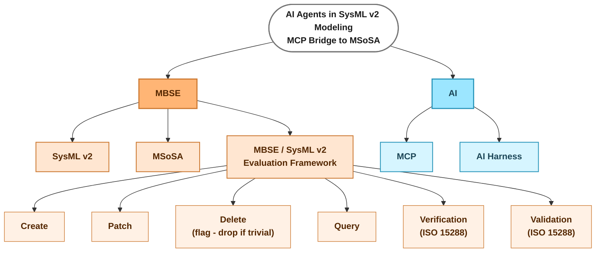

# Literature mind map — main subjects

> Working diagram (not thesis content). One root, two main points (MBSE, AI), each with their
> own children. Source-level leaves (theme → bib key) get added under each branch as literature
> research is grouped — see the "Quick reference by theme" table in `0. Index.md` for the current
> theme → source mapping to fold in here branch by branch.
>
> Renders directly in any Mermaid-aware viewer (VS Code Markdown preview with a Mermaid
> extension, GitHub, GitLab, Obsidian, mermaid.live). This file is the single source of truth.

**Open item:** "Delete" under Evaluation Framework is flagged — keep only if it turns out to be
a non-trivial capability to evaluate; drop otherwise.
