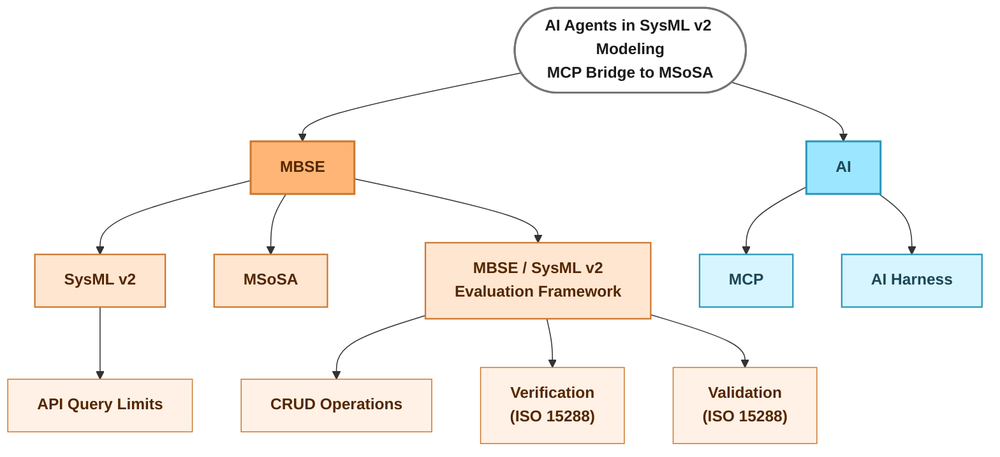

# Literature mind map — main subjects

> Working diagram (not thesis content). One root, two main points (MBSE, AI), each with their
> own children. Source-level leaves (theme → bib key) get added under each branch as literature
> research is grouped — see the "Quick reference by theme" table in `0. Index.md` for the current
> theme → source mapping to fold in here branch by branch.
>
> Renders directly in any Mermaid-aware viewer (VS Code Markdown preview with a Mermaid
> extension, GitHub, GitLab, Obsidian, mermaid.live). This file is the single source of truth.

**Open item:** "Delete" within CRUD Operations is flagged — keep as a sub-case only if it turns
out to be a non-trivial capability to evaluate; drop otherwise.

## Sources by node (table)

Rows = sources (25, from `bib/quellen.bib`), columns = mind-map nodes/leaves above. `X` marks that
a source is attached to that node. `MSoSA` and `Delete` have no source yet (open gaps). ⭐ marks the
3 most important sources overall (per `bib/quellen.bib`'s `[TOP 3]` annotations).

| # | Source | MBSE | AI | SysML v2 | MSoSA | EvalFW | API Query Limits | CRUD Ops | Create (Erstellen) | Patch (Korrektur) | Query (Abfragen) | Delete | Verification | Validation | MCP | AI Harness |
|---|---|:-:|:-:|:-:|:-:|:-:|:-:|:-:|:-:|:-:|:-:|:-:|:-:|:-:|:-:|:-:|
| 1 | `ahlbrecht2025mbsqle` | | | | | | X | | | | | | | | | |
| 2 | `alshami2026faultloc` | | | | | | | | | X | | | | | | |
| 3 | ⭐ `bazzal2026mcpmbse` | | | | | | X | | X | X | X | | | | X | |
| 4 | `boelsen2025guidelines` | | | X | | | | | | | | | | | | |
| 5 | `bouamra2025systemp` | | | X | | | | X | X | | | | | | | X |
| 6 | `cibrian2025validation` | | | | | | | | | | | | X | | | |
| 7 | `dehart2024llm` | | X | | | | | | | | | | | | | |
| 8 | `dehn2025nl2sysml` | | | | | | | | X | | | | | | | |
| 9 | ⭐ `dempsey2026nativeai` | | | | | X | | | X | | | | | | X | X |
| 10 | `fresemann2025review` | | | | | X | | | | | | | | | | |
| 11 | `hasan2026mcpsmells` | | | | | | | | | | | | | | X | |
| 12 | ⭐ `incose2007mbsevision` | X | | | | | | | | | | | | | | |
| 13 | `iso-15288` | | | | | | | | | | | | X | X | | |
| 14 | `liparulo2026hwmcp` | | | | | | | | | | | | | | | X |
| 15 | `molinari2026engiai` | | | | | X | | | | | | | | | | |
| 16 | `molnar2024formalverification` | | | | | | | | | | | | X | | | |
| 17 | `omg-kerml` | | | X | | | | | | | | | | | | |
| 18 | `pradasgomez2026ductile` | | | | | X | | | | | | | | | | |
| 19 | `qualis2025hallucination` | | | | | | | | X | | | | | | | |
| 20 | `quast2026graphrag` | | | | | | | X | | | X | | | | | X |
| 21 | `ratzke2025constraints` | | | | | | | | | | | | X | | | |
| 22 | `shefa2026reqquality` | | | | | X | | | | | | | | | | |
| 23 | `shi2026cae` | | | | | X | | | | | | | | | | |
| 24 | `wang2026pufibara` | | | | | X | | | | | | | | | | |
| 25 | `wu2025sysforge` | | | | | | | | | X | | | | | | |

## Sources, one line each

1. **ahlbrecht2025mbsqle** — The standard SysML v2 API query model has no direct graph traversal
   and hits performance bottlenecks; proposes SQLite as a traversable intermediate representation.
   Motivates querying inside the tool / a semantic layer in the bridge rather than through the raw REST API.
2. **alshami2026faultloc** — Syntactic-vs-semantic fault distinction plus KG-driven systematic
   fault injection is the model for this thesis's fault taxonomy/injection method on Apollo 11;
   plain-LLM repair rate <3% sets the no-tool-arm baseline expectation for *Korrektur*.
3. **bazzal2026mcpmbse** — ⭐ **[TOP 3]** Fraunhofer IEM/HNI/FAU/Audi MCP framework built directly on the
   standard SysML v2 API (C#.NET, official reference API+DB in Docker, open source); three tool
   classes (creation/modification/analysis) mirror this thesis's Create/Patch/Query use cases and it
   is the closest scientific competing work — the "Option A" contrast to this thesis's MSoSA-internal
   "Option B" attachment. Two qualitative DSRM case studies (agentic use-case generation;
   signal-redundancy optimization) are demonstrations only, with no ground truth or quantitative
   metrics; its own discussion names tool-count limits and single-agent scope as open issues.
4. **boelsen2025guidelines** — SysML v2 modeling guidelines; foundational reference for the SysML v2
   node alongside `omg-kerml`.
5. **bouamra2025systemp** — Four-agent NL→SysML v2 pipeline (spec extraction → template skeleton →
   completion → parse-repair loop) whose scaffolding ablation lifts syntax convergence from 1/5 to
   4/5 scenarios, but stays syntax-only with no semantic ground truth — exactly the gap this thesis's
   *Erstellen* metric (syntactic validity + expert rubric) closes. States verbatim that model-quality
   assessment "remains constrained by the absence of standard benchmarks" (motivating the EvalFW
   node) and independently confirms the SysML v2 corpus-scarcity fact (<150 example scenarios total
   across Pilot-Implementation + GfSE) that justifies choosing Apollo 11 as the primary model.
6. **cibrian2025validation** — Practical SysML v2 verification tool and the clearest example of the
   field's validation/verification terminology conflation; despite self-labeling its method
   "validation," an ISO 15288 audit unanimously verdicted it as verification.
7. **dehart2024llm** — Origin paper (July 2024) of the whole LLM×SysML v2 topic, arguing SysML v2's
   English-like textual syntax plus LLM maturation make conversational model interaction feasible;
   three OpenAI Assistants-API case studies (direct text-file regex/Python edits, a conversational
   query endpoint, notebook-based requirement validation) are single-run proofs of concept with no
   ground truth and an explicit automation-bias warning. Predates MCP and is the earliest instance of
   the "no structured tool, LLM edits text directly" pattern this thesis's no-tool/thin-bridge arms
   contrast against.
8. **dehn2025nl2sysml** — Primary reference for the Create/*Erstellen* leaf: four-component structured
   prompting (role/goal, ontology, few-shot examples, NL requirements) for NL→SysML v2 generation,
   evaluated on an automotive case with precision/recall/F1, traceability coverage, syntax pass/fail
   and semantics scores across 3 runs. Ontology improves traceability but few-shot examples are
   essential for syntactic correctness, and structured prompting trades quality for token/runtime
   cost; logical-to-physical element mapping stays unstable. File-based (no modelling tool) — supplies
   this thesis's element-level metric template, contrasted against the live-tool/MSoSA attachment.
9. **dempsey2026nativeai** — ⭐ **[TOP 3]** Controlled 3-arm SysML v2 benchmark (baseline / CLI validation
   loop / full MCP-knowledge+skills tooling, 8 tasks × 2 scales, Claude Opus 4.6) that directly
   templates this thesis's no-tool/thin-bridge/semantic-bridge ablation design: validation alone
   kills syntax errors but barely moves the modeling-pattern score (78.3→71.7), while curated
   knowledge+skills raises it to 94.1. Its worked drone-swarm example (0 syntax errors, 97.2/100
   pattern score, yet silently drifted parameters) is the clearest illustration of "syntactically
   valid but wrong," motivating the expert-rubric half of the *Erstellen* metric. File-based
   (Syside LSP) with a knowledge-retrieval MCP server, not a model-editing one — the thesis
   differentiates on the live-model/industrial-tool axis.
10. **fresemann2025review** — Structured literature review of 20 LLM-for-system-modeling
    publications supplying the task taxonomy (creation/analysis/modification/reformulation) onto
    which the EvalFW node and its CRUD/Verification/Validation children are mapped. Points to MCP as
    the emerging mechanism for supplying engineering context beyond prompting-only methods and flags
    the field's lack of standardized, comparable evaluation criteria — the same gap `bouamra2025systemp`
    and `quast2026graphrag` independently name.
11. **hasan2026mcpsmells** — Empirical study of 856 MCP tools across 103 servers finding 97.1% of
    tool descriptions carry at least one "smell" (56% fail to state purpose); augmenting all
    description components lifts task success by a median 5.85 pp but costs +67% execution steps
    with 17% regressions. Supplies the description-quality rubric for this thesis's bridge tools and
    flags a confound to control between the thin- and semantic-bridge arms, so the semantic arm
    doesn't win merely on better-written tool text.
12. **incose2007mbsevision** — ⭐ **[TOP 3]** The original, canonical coinage of MBSE (INCOSE SE Vision
    2020), verified directly from the primary PDF; nearly every downstream MBSE paper traces its
    definition to this document — foundational reference for the MBSE root node.
13. **iso-15288** — Source of the ISO 15288 verification/validation definitions used to audit and
    classify every other candidate verification source here (six non-ISO candidates independently
    verdicted "verification" despite self-labeling). Also the only source under the Validation leaf —
    no reviewed source yet performs actual ISO-validation (behavioral simulation / operational-
    scenario execution against stakeholder objectives), an open gap to flag in related work.
14. **liparulo2026hwmcp** — Closest methodological sibling (adjacent hardware-design domain, not
    SysML v2): purpose-built MCP server over a stateful tool, a task benchmark (single-op/chain/
    invalid/misspelled), and ablations of system prompt, tool-description detail, context scope, and
    single- vs. multi-agent architecture across 7 open models. Transferable findings: comprehensive
    tool descriptions reduce failures (pairs with `hasan2026mcpsmells`), few-shot prompting can cause
    severe inaction, cumulative context hurts constrained models, and multi-agent decomposition helps
    weak workers at extra call cost; its task taxonomy maps onto this thesis's planned difficulty tiers.
15. **molinari2026engiai** — Capability-based evaluation framework for tool-connected engineering
    agents (adjacent domain, EngiBench) that scores workflow execution, parameter selection,
    orchestration and code authoring separately rather than one end-to-end success rate, using
    execution traces plus the resulting artifact as evidence. Across four LLM backends, proprietary
    models score 96–97% on workflow tasks vs. 55–78% for open-source, with tool-based
    decision-making much lower (20–53%) — supplies the methodological argument for this thesis's
    per-use-case scoring and trace-based failure-mechanism reporting.
16. **molnar2024formalverification** — Broadest SysML v2 verification tool landscape survey among
    the audited verification candidates.
17. **omg-kerml** — KerML/SysML v2 foundation specification; foundational reference for the SysML v2
    node alongside `boelsen2025guidelines`.
18. **pradasgomez2026ductile** — DUCTILE, an industrial aerospace structural-analysis agent
    (adjacent domain) separating *adaptive orchestration* by the LLM from *deterministic execution*
    by verified engineering tools under engineer supervision, evaluated against expert-defined
    acceptance criteria over 10 repeated independent runs plus deployment with practising engineers.
    Template for this thesis's agent/tool division of labour, reliability reporting via repeated
    runs (pass^k), and discussion of supervisory-fatigue effects in the human-in-the-loop framing.
19. **qualis2025hallucination** — Tri-layer knowledge graph (SysML pattern KG / domain-specific KG /
    auto-generated system-specific KG) feeding reusable prompt templates to ground generation against
    hallucinated constructs; satellite-system case study with manually curated ground truth. Produces
    structurally valid models reliably but limited semantic fidelity/determinism — motivates grounding
    the agent in the *live* model/tool state rather than a hand-built static KG, the choice this thesis
    makes instead.
20. **quast2026graphrag** — Primary reference for the Query/*Abfragen* leaf: GraphRAG multi-agent
    system (Supervisor + Graph Query Agent) over a Neo4j graph parsed from SysML v2 text, RFLP-schema'd,
    hybrid graph+vector indexing with Cypher queries. Evaluated on a synthetic battery-EV model across
    4 LLMs — best model reaches 93% overall / 90% multi-hop accuracy, real ground-truth evaluation
    unlike other CRUD entries, the accuracy-metric template for *Abfragen*. Also independently states
    the same "lack of standardized benchmarks" gap as `bouamra2025systemp`; own limits: synthetic
    model, metamodel-specific parser, no user studies.
21. **ratzke2025constraints** — Explains the native KerML-CSP verification mechanism, complementing
    `omg-kerml`/`boelsen2025guidelines`.
22. **shefa2026reqquality** — [counter-evidence to H2] Adjacent-domain (requirements, not SysML v2)
    benchmark of ten OpenAI/Anthropic models judging requirement quality against expert-derived
    INCOSE-criteria ground truth, 100 runs × two requirement sets × five temperatures: the best model
    finds a median of only 47% of expert-identified issues while false-flagging 11%, and judgement-
    heavy criteria are almost always missed. Justifies expert-defined acceptance criteria plus a human
    second rater instead of LLM-as-judge, and warns that agentic orchestration risks *compounding*
    rather than correcting these deficiencies in the *Validierung*/*Verifizierung* use cases.
23. **shi2026cae** — Adjacent-domain (CAE/OpenFOAM) controlled comparison with information access and
    repair budget held fixed: a single-agent generic harness matches or beats specialised multi-agent
    systems on FoamBench (96.4% vs. 88.2%); execution-feedback repair and domain-knowledge tutorials
    explain the gains, scripted reflection adds nothing. Directly challenges H2 (semantic bridge > thin
    CRUD bridge) and motivates giving every tool arm the same validation-feedback loop so the semantic
    layer's effect is isolated from the repair-loop effect.
24. **wang2026pufibara** — Adjacent-domain (Modelica) methodological sibling: the Pufibara harness
    (persistent engineering state, evidence bound to the candidate that produced it, explicit submit
    action) plus source-grounded task construction yielding a 232-task benchmark (Model Repair/
    Generation/Tuning), each scored by a benchmark-owned evaluator outside the agent loop; beats
    Claude Code under matched backends at 76–83% fewer tokens. Source of the external-evaluator
    design principle (pairs with `shefa2026reqquality`'s LLM-as-judge warning) and the repair/
    generation/tuning split mapping onto this thesis's *Korrektur*/*Erstellen*/*Validierung*–
    *Verifizierung* use cases.
25. **wu2025sysforge** — SysForge: four-agent framework (conversational, context-synthesizer,
    designer, validator) around a dependency-aware KG retriever, iterating generate-validate-refine
    until the validator agent accepts the output; beats plain-LLM and semantic-RAG baselines on
    Pass@1/BLEU. Closest prior work for the Patch/*Korrektur* leaf's generate-validate-refine
    structure — the semantic-bridge arm's tool-native validation replaces its own Validator Agent.
