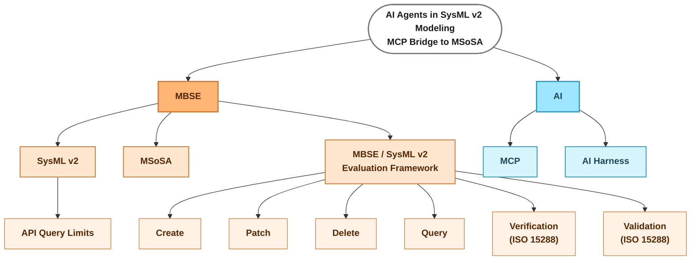

# Literature mind map — main subjects

> Working diagram (not thesis content). One root, two main points (MBSE, AI), each with their
> own children. Source-level leaves (theme → bib key) get added under each branch as literature
> research is grouped — see the "Quick reference by theme" table in `0. Index.md` for the current
> theme → source mapping to fold in here branch by branch.
>
> Renders directly in any Mermaid-aware viewer (VS Code Markdown preview with a Mermaid
> extension, GitHub, GitLab, Obsidian, mermaid.live). This file is the single source of truth.

**Open item:** "Delete" under Evaluation Framework is flagged — keep only if it turns out to be
a non-trivial capability to evaluate; drop otherwise.

## Sources per leaf (so far)

- **MBSE** (node): `incose2007mbsevision` — canonical MBSE definition (INCOSE SE Vision 2020).
- **SysML v2** (child): `boelsen2025guidelines`, `omg-kerml` — foundations.
- **API Query Limits** (leaf under SysML v2): `ahlbrecht2025mbsqle` — the standard
  SysML v2 API query model features no direct graph traversal, leading to performance
  bottlenecks; proposes SQLite as a traversable intermediate representation. Motivates querying
  inside the tool / a semantic layer in the bridge rather than going through the REST API.
- **Verification (ISO 15288)**: `iso-15288`, `molnar2024formalverification`, `cibrian2025validation`,
  `ratzke2025constraints`. All six non-ISO candidates were independently audited (evidence-auditor
  subagents, 19.09.2026) against the ISO 15288 definitions and unanimously verdicted
  **Verification**, despite four of them self-labeling their method "validation" in the title,
  abstract, or body. Curated down 19.09.2026 to the 3 most valuable: Molnar (broadest tool
  landscape), Cibrian (practical tool + clearest conflation example), Ratzke (explains the native
  KerML-CSP mechanism, complements `omg-kerml`/`boelsen2025guidelines`). Removed: Zavada
  (redundant conflation example), Kausch (Isabelle theorem-proving, tangential to an agent/MCP
  workflow), Lu (SysML v1, not v2). See `bib/quellen.bib` notes for per-paper quotes/rationale.
- **Validation (ISO 15288)**: `iso-15288` only. **Open gap** — no reviewed source performs actual
  ISO-validation (behavioral simulation or operational-scenario execution against
  stakeholder/business objectives). Worth stating explicitly in related work, or finding a
  genuine validation source before the thesis leans on this leaf.
- **Create / Patch / Delete / Query**: no sources yet.
- Excluded: `bergemann` (multi-view consistency survey) — audited and found to perform neither
  verification nor validation; not added to the bib.
